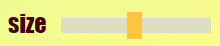
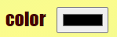
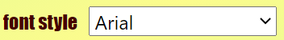
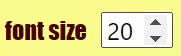

# Software Studio 2021 Spring
## Assignment 01 Web Canvas

### Scoring

| **Basic components**                             | **Score** | **Check** |
| :----------------------------------------------- | :-------: | :-------: |
| Basic control tools                              | 30%       | Y         |
| Text input                                       | 10%       | Y         |
| Cursor icon                                      | 10%       | Y         |
| Refresh button                                   | 10%       | Y         |

| **Advanced tools**                               | **Score** | **Check** |
| :----------------------------------------------- | :-------: | :-------: |
| Different brush shapes                           | 15%       | Y         |
| Un/Re-do button                                  | 10%       | Y         |
| Image tool                                       | 5%        | Y         |
| Download                                         | 5%        | Y         |

| **Other useful widgets**                         | **Score** | **Check** |
| :----------------------------------------------- | :-------: | :-------: |
| Dash line                                        | 1~5%      | Y         |
| Line                                             |           | Y         |
| Hexagon (hollow/fill)                            |           | Y         |
| Rainbow pen                                      |           | Y         |
| Spray gun                                        |           | Y         |

---

### How to use 
以下介紹每個按鈕的功能

 調整筆刷、擦布大小

 更改筆刷顏色

 更換字型

 更改字型大小

 **pen**: 一般筆刷

 **eraser**: 擦掉經過的區域

 **text input**: 點擊畫布可開始打字，打完後點擊畫布文字就會顯示在畫布上

  **rectangle (hollow/fill)**: 畫空心或實心矩形

  **triangle (hollow/fill)**: 畫空心或實心三角形

  **circle (hollow/fill)**: 畫空心或實心圓形

 **undo**: 復原

 **redo**: 取消復原

 **reset**: 清空整個畫布

 **upload**: 上傳圖片到畫布上

 **download**: 下載畫布，存為img.png

### Function description
Decribe your bouns function and how to use it.

 **dash line**: 畫虛線

 **line**: 畫直線

 **rainbow pen**: 彩虹筆，畫圖時更改筆刷顏色

 **spray gun**: 噴槍效果

  **hexagon (hollow/fill)**: 畫空心或實心六邊形

### Gitlab page link

[https://108062108.gitlab.io/AS_01_WebCanvas/](https://108062108.gitlab.io/AS_01_WebCanvas/)
